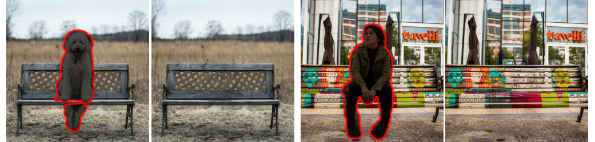
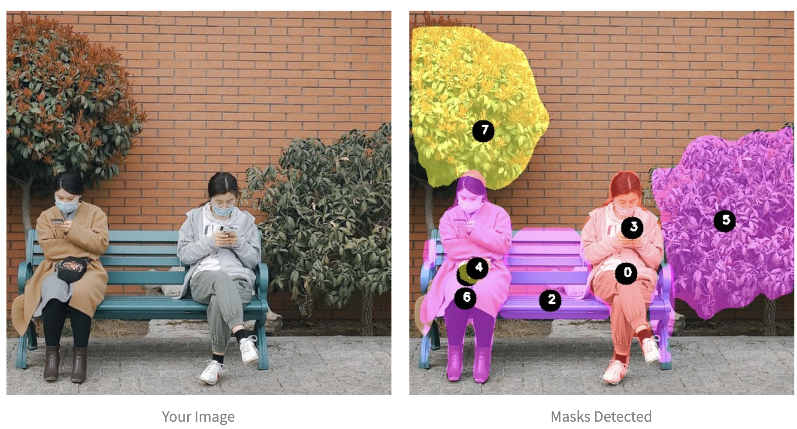
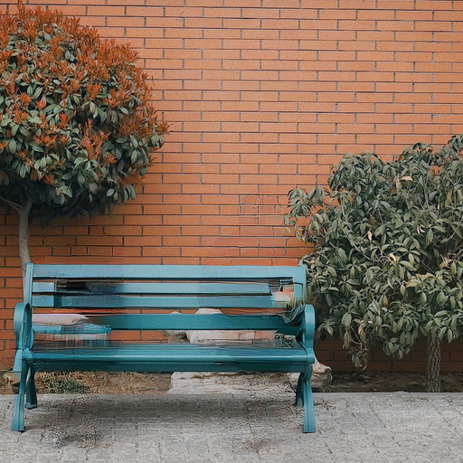

# A Streamlit app for Inpainting-with-Stable-Diffusion
This repo is created from [Official-stable-diffusion-repo](https://github.com/CompVis/stable-diffusion)

## Inpainting using Stable Diffusion

Stable diffusion can be used for inpainting jobs by providing a mask which indicates the portion to be inpainted and original image as below



To get the inpainting model, run the below command

```
wget -O models/ldm/inpainting_big/last.ckpt https://heibox.uni-heidelberg.de/f/4d9ac7ea40c64582b7c9/?dl=1
```
and add it at models/ldm/inpainting_big/

### Inference with an example

```
python scripts/inpaint.py
```
Please note that the script takes in `inpaint(indir)`

`indir` should contain images `*.png` and masks `<image_fname>_mask.png` like the examples provided in `data/inpainting_examples`.


## Editing with editurphotowithai.com

With stable diffusion inpainting, mask input is from the user. To make it easier, we have mask creation for individual objects from the image 
using instance segmentation with Maskrcnn pretrained model

### Mask generation 

```
python detect_objects.py
```



And with just selecting the numbers of whichdetections to keep, will yeild the edited image




To try the UI - please visit [www.editurphotowithai.com](www.editurphotowithai.com)


